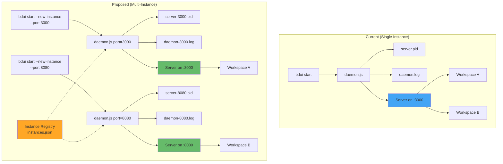

# Multi-Instance Feature - Architecture Diagrams

This document contains visual diagrams illustrating the multi-instance feature
design.

## 1. Multi-Instance Architecture Overview

This diagram shows the current single-instance architecture compared to the
proposed multi-instance architecture.



**Key Changes:**

- Port-specific PID and log files enable true isolation
- Instance registry tracks all running instances
- Each instance serves one workspace independently
- Backward compatible: default behavior unchanged

## 2. Remove Instance and Orphan Detection Flows

This diagram shows the detailed logic flows for the new remove-instance command
and orphan detection feature.

```mermaid
graph TB
    subgraph "Remove Instance Flow"
        RM1[bdui remove-instance] --> RM2{Port<br/>specified?}
        RM2 -->|Yes| RM3[Find by port]
        RM2 -->|No| RM4[Find by workspace]
        RM3 --> RM5{Instance<br/>found?}
        RM4 --> RM5
        RM5 -->|No| RM6[Error: Not found]
        RM5 -->|Yes| RM7{Process<br/>running?}
        RM7 -->|Yes + no --force| RM8[Error: Still running]
        RM7 -->|Yes + --force| RM9[Remove anyway]
        RM7 -->|No| RM9
        RM9 --> RM10[Remove from registry]
        RM10 --> RM11[Remove PID file]
        RM11 --> RM12[Success message]
    end

    subgraph "Orphan Detection Flow"
        ST1[bdui start<br/>--new-instance] --> ST2{Instance exists<br/>for workspace?}
        ST2 -->|No| ST3[Normal start]
        ST2 -->|Yes| ST4{Process<br/>running?}
        ST4 -->|Yes| ST5[Error: Already running]
        ST4 -->|No| ST6[Show warning]
        ST6 --> ST7[Remove from registry]
        ST7 --> ST8[Remove PID file]
        ST8 --> ST9[Continue with start]
        ST9 --> ST3
    end

    subgraph "Cleanup Orphans Flow"
        CL1[bdui remove-instance<br/>--cleanup-orphans] --> CL2[Get all instances]
        CL2 --> CL3[Filter dead processes]
        CL3 --> CL4{Any<br/>orphans?}
        CL4 -->|No| CL5[No orphans found]
        CL4 -->|Yes| CL6[List orphans]
        CL6 --> CL7[Remove each orphan]
        CL7 --> CL8[Success: N cleaned]
    end

    style RM6 fill:#ef5350
    style RM8 fill:#ef5350
    style ST5 fill:#ef5350
    style RM12 fill:#66bb6a
    style ST3 fill:#66bb6a
    style CL8 fill:#66bb6a
    style ST6 fill:#ffa726
    style CL6 fill:#ffa726
```



**Key Features:**

- **Remove Instance**: Supports removal by workspace or port with safety checks
- **Orphan Detection**: Automatic cleanup on start with clear warnings
- **Batch Cleanup**: `--cleanup-orphans` flag removes all dead instances at once
- **Safety First**: Prevents accidental removal of running instances without
  `--force`

## 3. Instance Registry Data Structure

The instance registry (`~/.beads-ui/instances.json`) tracks all running
instances:

```json
[
  {
    "workspace": "/Users/me/project-a",
    "port": 3000,
    "pid": 12345,
    "started_at": "2026-01-06T10:30:00.000Z"
  },
  {
    "workspace": "/Users/me/project-b",
    "port": 8080,
    "pid": 12346,
    "started_at": "2026-01-06T10:31:00.000Z"
  }
]
```

**Registry Operations:**

- `registerInstance()` - Add new instance on start
- `unregisterInstance()` - Remove instance on stop
- `findInstanceByWorkspace()` - Lookup by workspace path
- `findInstanceByPort()` - Lookup by port number
- `getAllOrphanedInstances()` - Find all dead processes
- `cleanupStaleInstances()` - Remove entries with dead PIDs

## Usage Flow Examples

### Starting Multiple Instances

```
User Action                          System Response
───────────────────────────────────  ─────────────────────────────────
cd ~/project-a
bdui start --port 3000 \            → Creates server-3000.pid
  --new-instance --open             → Creates daemon-3000.log
                                    → Adds to instances.json
                                    → Opens http://127.0.0.1:3000

cd ~/project-b
bdui start --port 8080 \            → Creates server-8080.pid
  --new-instance --open             → Creates daemon-8080.log
                                    → Adds to instances.json
                                    → Opens http://127.0.0.1:8080
```

### Orphan Detection After Reboot

```
User Action                          System Response
───────────────────────────────────  ─────────────────────────────────
[System reboots]                    → All PIDs are now invalid

cd ~/project-a
bdui start --new-instance           → Detects orphaned instance
                                    → Shows warning:
                                      "Found orphaned instance
                                       Port: 3000
                                       PID: 12345 (not running)"
                                    → Auto-cleans registry
                                    → Starts fresh instance
```

### Manual Instance Removal

```
User Action                          System Response
───────────────────────────────────  ─────────────────────────────────
bdui remove-instance                → Finds instance for current workspace
                                    → Checks if process is running
                                    → Removes from registry
                                    → Removes PID file
                                    → Shows success message

bdui remove-instance \              → Finds all orphaned instances
  --cleanup-orphans                 → Lists each orphan
                                    → Removes all orphans
                                    → Shows count cleaned
```
